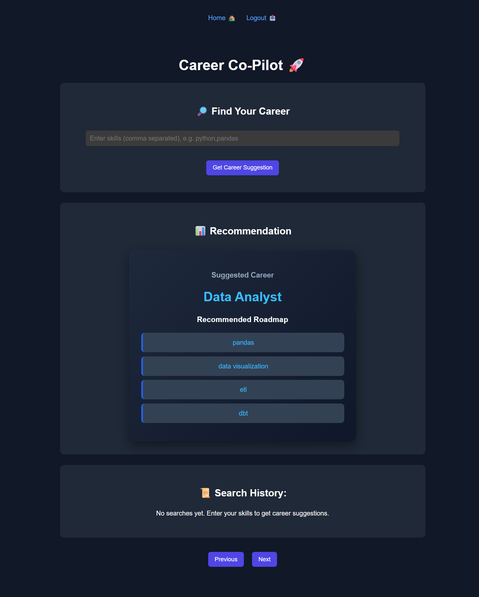
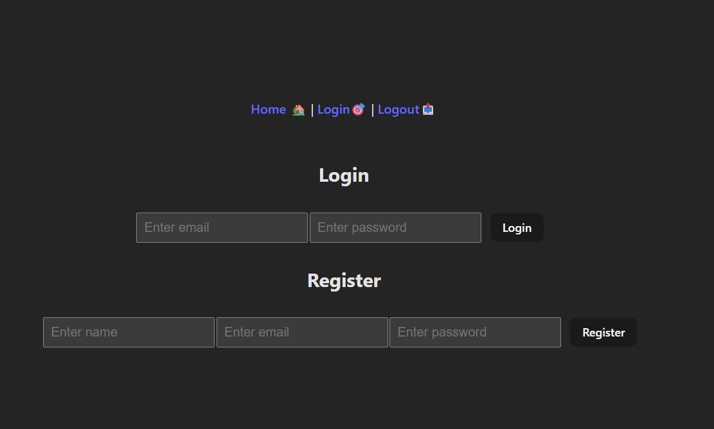
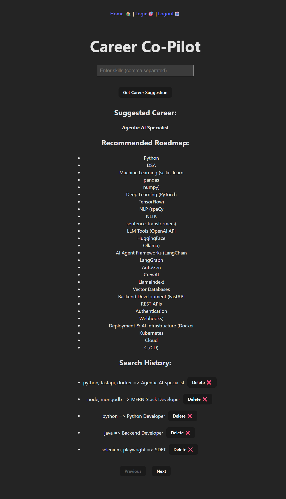

# Career Co-Pilot 🚀

Career Co-Pilot is a **full-stack web application** that recommends career paths based on a user’s skills.  
Users can enter their skills, receive a recommended career along with a learning roadmap, and track their search history.

This project demonstrates **modern full-stack development practices**, including authentication, REST APIs, and database integration.

---

## 🧰 Tech Stack

### Frontend
- React (Vite)
- Fetch API
- CSS

### Backend
- Flask (Python)
- JWT Authentication
- Bcrypt password hashing

### Database
- PostgreSQL

---

## ✨ Features

- 🔐 User registration and login
- 🧠 Skill-based career recommendation
- 📚 Learning roadmap suggestions
- 📜 Search history tracking
- 🗑 Delete history entries
- 📄 Pagination for history results
- 🔒 Protected API routes using JWT
- ⚡ Centralized API request handler (`api.js`)

---

## 🧠 How It Works

1. User enters skills in the frontend UI.
2. React converts the input into an array.
3. Skills are sent to the Flask backend via a POST request.
4. Flask processes the skills using rule-based logic.
5. Backend returns the recommended career and roadmap.
6. React dynamically displays the results and stores search history.

---

## 🏗 Architecture


React Frontend
│
▼
Flask REST API
│
▼
JWT Authentication
│
▼
PostgreSQL Database

---

## ▶️ Running the Project Locally

### 1️⃣ Clone the Repository

```bash
git clone https://github.com/abhilash2124/career-co-pilot.git
cd career-co-pilot


2️⃣ Backend Setup
cd backend
python -m venv venv
pip install -r requirements.txt
python app.py

Backend runs on:
http://127.0.0.1:5000


3️⃣ Frontend Setup
cd frontend
npm install
npm run dev

Frontend runs on:
http://localhost:5173


🔐 Environment Variables
Create a .env file inside the backend folder:
JWT_SECRET_KEY=your_secret_key
DB_HOST=localhost
DB_NAME=career_copilot
DB_USER=postgres
DB_PASSWORD=your_password


📌 Future Improvements
AI/ML based career recommendation model
Improved UI/UX design
Cloud deployment (Render / Railway)
Larger career dataset

👨‍💻 Author
Abhilash Addagatla
GitHub:
https://github.com/abhilash2124


## 📸 Application Screenshots

### Home Page


### Login Page


### Career Recommendation + History

